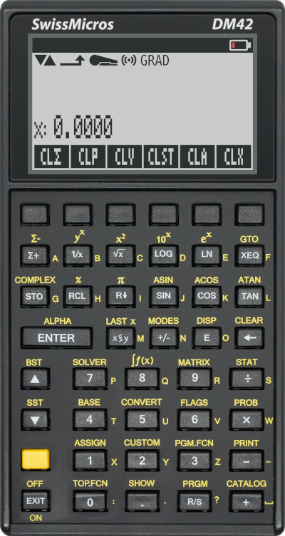

# DM42 skin for the Free42 simulator

This repository contains the sources for generating a [DM42][] skin for the
[Free42 simulator][].

## Quick install

1. Download the desired skin from the [releases page][] (see Notes below
   regarding the sizes), and extract the files form the `ZIP`.

2. Copy the extracted `.gif` and `.layout` files to the [Free42 skin folder][].

3. Select the newly installed skin in the Free42 simulator.

## Building from source

1. Install python `pillow` dependency:

        pip install pillow

2. Run the `generate.py` script with the desired parameters (see Notes below
   regarding size):

        ./generate.py 3

3. Copy the generated `.gif` and `.layout` files from `skins/<NAME>/` to the
   [Free42 skin folder][.

4. Select the newly installed skin in the Free42 simulator.

## Notes

**TL;DR**: _You probably want size 2 or 3 on your Laptop if the size of the
simulator is fixed by the size of the skin. On your phone where the simulator
adapt to the size of the screen, you probably want the best image quality, go
for 12._

The GTK version of Free42 for Linux can not — as far as I know — be scaled
manually, that means the size of the `GIF` defines the size of the simulator on
screen. People have personal preferences regarding the on-screen size of
their calculator, so I made a script to generate different desired skin sizes.

It is not always possible to use a floating-value display scales
([source](https://thomasokken.com/free42/skins/#nonint)):

> Non-integer display scales are supported in Free42 for Android, iOS, and
> MacOS, release 2.0.24g and later.

That means the display can only be a multiple of — the original — 131 pixels
wide. And if we want the labels on screen to be aligned with the buttons bellow,
the skin can only be scaled up and down by integer values as well.

The solution I made is the `generate.py` scripts that take 3 parameters:

    ./generate.py [<x_magnification>] [<y_magnification>] [<skin_name>]

The `x` magnification constrains and defines the final size of the skin. The `y`
magnification can be used to have taller (or smaller) digits on screen, but it
does not have impact on the skin size. If omitted if defaults to twice the `x`
magnification. Finally the skin name can be optionally given, allowing you to
give meaningful names to your skins.

[releases page]: https://github.com/StreakyCobra/dm42-skin/releases
[DM42]: https://www.swissmicros.com/dm42.php
[Free42 simulator]: https://thomasokken.com/free42/
[Free42 skin folder]: https://thomasokken.com/free42/skins/README.html
