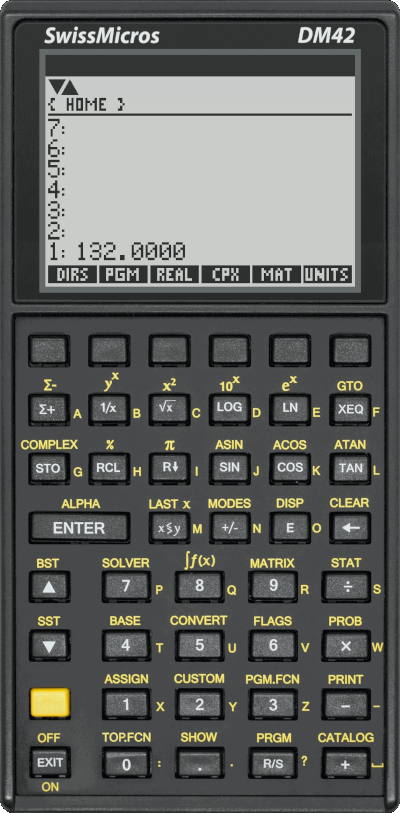

# High-resolution DM42 skin for the Free42 simulator

This repository contains a high-resolution [DM42][] skin for the [Free42][] and
[Plus42][] simulators. This is a [labor of love](#for-the-curious-how-was-it-done).

If you are a RPN/RPL lover, the combination of a [DM42][] and the [Free42][] (or
[Plus42][]) simulator together with this skin offers you both a beautiful
physical device that you can keep on your desk, and the same beautiful
calculator virtually with you all the time on your phone. It is the last
calculator you will ever need!

[DM42]: https://www.swissmicros.com/product/dm42
[Free42]: https://thomasokken.com/free42/
[Plus42]: https://thomasokken.com/plus42/

## Installation

### Quick installation on mobile

1. [Install Free42][] or [Install Plus42][].

2. Go to Main Menu -> Select Skin -> Load, and use the [following
   URL](https://raw.githubusercontent.com/StreakyCobra/dm42-skin/releases/v1.4/dm42_12.layout):

       https://raw.githubusercontent.com/StreakyCobra/dm42-skin/releases/v1.4/dm42_12.layout

This URL points to a high-resolution skin. This looks really nice on mobile but
this may be an issue for old phones. If this is a problem, smaller skins are
provided as well. Their URLs can be obtained by looking in the [`releases`
branch](https://github.com/StreakyCobra/dm42-skin/tree/releases).

### General installation method

1. [Install Free42][] or [Install Plus42][].

2. Download the desired skin files from the [releases page][] (see
   [Notes](#Notes) below regarding the sizes).

3. Copy the extracted `.gif` and `.layout` files to the [Free42 skin folder][].

4. Select the newly installed skin in the Free42 simulator.

[Install Free42]: https://thomasokken.com/free42/#downloads
[Install Plus42]: https://thomasokken.com/plus42/#downloads
[releases page]: https://github.com/StreakyCobra/dm42-skin/releases
[Free42 skin folder]: https://thomasokken.com/free42/skins/README.html

### Building from source

1. Install python `pillow` dependency:

        pip install pillow

2. Run the `generate.py` script with the desired parameters (see [Notes](#Notes)
   below regarding size and parameters):

        ./generate.py 3

3. Copy the generated `.gif` and `.layout` files from `skins/<NAME>/` to the
   [Free42 skin folder][].

4. Select the newly installed skin in the Free42 simulator.

## For the curious: How was it done?

A 6000×4000 pixels picture of the calculator has been taken with a Sony α7-III
in one of these lightweight led-powered photography box. The picture has been
cropped and the perspective manually corrected to have the calculator picture as
"orthogonal" as possible. Several hours of fine-tuning in Gimp followed, to fix
small imperfections, to correct light, to remove noise, to enhance texts, etc.
but without going too far to avoid removing the real-look feel of the skin. The
background has been removed and replaced with transparent pixels. The
annunciators have been recreated in Inkscape for a better look. A second "layer"
has been added to the GIF with keys slightly grayed to offer a nice visual
effect when they are pressed. The position of each key has been manually looked
in the full-resolution picture and saved in a JSON file to allow making resized
version of the skin. A Python script has been made to generate both the resized
version of the GIF as well as the layout file that goes with it. The DM42 has
an additional row of key at the top, offering direct access to the row below
when menu buttons are shown on the screen. The layout file is built in a way to
allow the same behavior in Free 42 with this skin.

## Notes

**TL;DR**: _You probably want the size 2 or 3 on your Laptop because the size of
the simulator is fixed by the size of the skin. On your phone where the
simulator adapts to the size of the screen, you may want the best image quality,
so go for 12._

The GTK version of Free42 for Linux can not — as far as I know — be scaled
manually, that means the size of the skin defines the size of the simulator on
screen. People have personal preferences regarding the on-screen size of
their calculator, so I made a script to generate different skin sizes.

As mentioned in the Free 42 documentation it is not always possible to use a
floating-value display scale
([source](https://thomasokken.com/free42/skins/#nonint)):

> Non-integer display scales are supported in Free42 for Android, iOS, and
> MacOS, release 2.0.24g and later.

This means that for compatibility purposes the display should be a multiple of
— the original — 131 pixels width. Therefore, if we want the menu labels on
screen to be aligned with their keys bellow, the skin should be scaled up and
down by integer values as well.

The solution I made is to make a `generate.py` scripts that take 3 parameters:

    ./generate.py [<x_magnification>] [<y_magnification>] [<skin_name>]

The `x` magnification constrains and defines the final size of the skin. The `y`
magnification can be used to make vertically taller (or smaller) digits on
screen, but it does not have impact on the skin size. If omitted if defaults to
twice the `x` magnification. Finally the skin name can be optionally passed to
give meaningful names to your skins.

The adaptive screen size for [Plus42][] is subject to some rounding that shows
off as content not using the whole screen at some scale. The size 12 for mobile
works quite well though.
